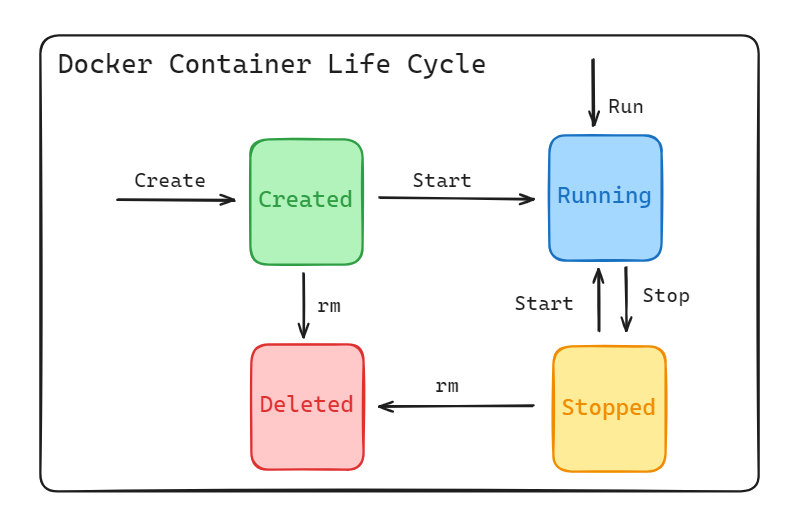

# The Lifecycle of a Container



This document outlines the lifecycle of a Docker container, from creation to deletion, using the example of a container named "percy."

## 1. Creating and Starting a Container

To create and start a Docker container, use the `docker run` command. This example names the container "percy" and starts an interactive bash shell within an Ubuntu container:

```sh
docker run --name percy -it ubuntu:latest /bin/bash
```

Once the command is executed, we are placed inside the container shell:

```sh
root@9cb2d2fd1d65:/#
```

## 2. Writing Data to the Container

Within the container, we can write data to the filesystem. The following commands navigate to the `/tmp` directory, create a new file, and verify its contents:

```sh
root@9cb2d2fd1d65:/# cd /tmp
root@9cb2d2fd1d65:/tmp# ls -l
total 0

root@9cb2d2fd1d65:/tmp# echo "This is the file about container lifecycle" > newfile
root@9cb2d2fd1d65:/tmp# ls -l
total 4
-rw-r--r-- 1 root root 49 Apr 27 11:22 newfile

root@9cb2d2fd1d65:/tmp# cat newfile
This is the file about container lifecycle
```

## 3. Stopping the Container

To stop the container, use the `docker stop` command:

```sh
docker stop percy
```

Stopping a container is like putting it on vacation—it stops running but retains its data and configuration.

## 4. Listing Containers

To verify the container's status, list all running containers:

```sh
$ docker ps
```

Since the container is stopped, it won't appear in the list. To show all containers, including stopped ones, use:

```sh
$ docker ps -a
```

We should see an output similar to this:

```sh
CONTAINER ID  IMAGE          COMMAND     CREATED   STATUS      NAMES
9cb2d2fd1d65  ubuntu:latest  "/bin/bash" 4 mins    Exited (0)  percy
```

## 5. Restarting the Container

Restart the stopped container with the `docker start` command:

```sh
$ docker start percy
percy
```

Check the running containers again:

```sh
$ docker ps
CONTAINER ID  IMAGE          COMMAND      CREATED  STATUS     NAMES
9cb2d2fd1d65  ubuntu:latest  "/bin/bash"  4 mins   Up 7 secs  percy
```

## 6. Verifying Data Persistence

Reattach to the container to verify the data persistence:

```sh
$ docker exec -it percy bash
root@9cb2d2fd1d65:/#
```

Check the file created earlier:

```sh
root@9cb2d2fd1d65:/# cd /tmp
root@9cb2d2fd1d65:/tmp# ls -l
-rw-r--r-- 1 root root 49 Apr 27 11:22 newfile

root@9cb2d2fd1d65:/tmp# cat newfile
This is the file about container lifecycle
```

## 7. Deleting the Container

To delete the container, first stop it if it’s running:

```sh
$ docker stop percy
percy
```

Then remove the container:

```sh
$ docker rm percy
percy
```

Verify the container has been deleted:

```sh
$ docker ps -a
```

No containers should be listed.

